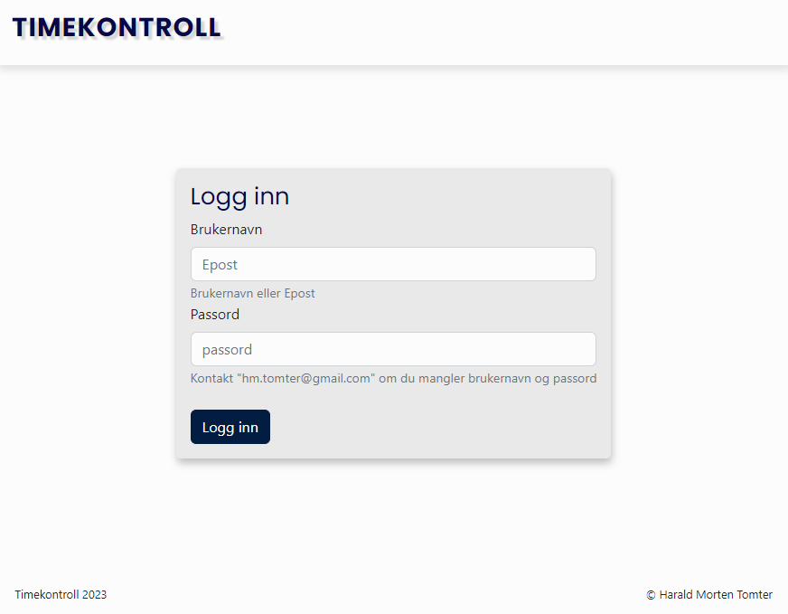

# Timekontroll | Registrering av arbeidstimer via web

This project was bootstrapped with [Create React App](https://github.com/facebook/create-react-app).

## Beskrivelse

Enkel webapplikasjon hvor du kan registrere arbeidstimer.
Ta kontakt om du vil teste prosjektet og vil låne bruker/passord.

## Bygget med 
- [React App]
- [HTML]
- [CSS]
- [JavaScript]
- [Sass](https://sass-lang)
- [Bootstrap](https://getbootstrap.com)
- [Strapi](https://docs.strapi.io/developer-docs/latest/getting-started/introduction.html)

## Installasjon

- Last ned koden og kjør NPM install i terminalen
- Kjør <<npm run start>> for å starte liveserver

